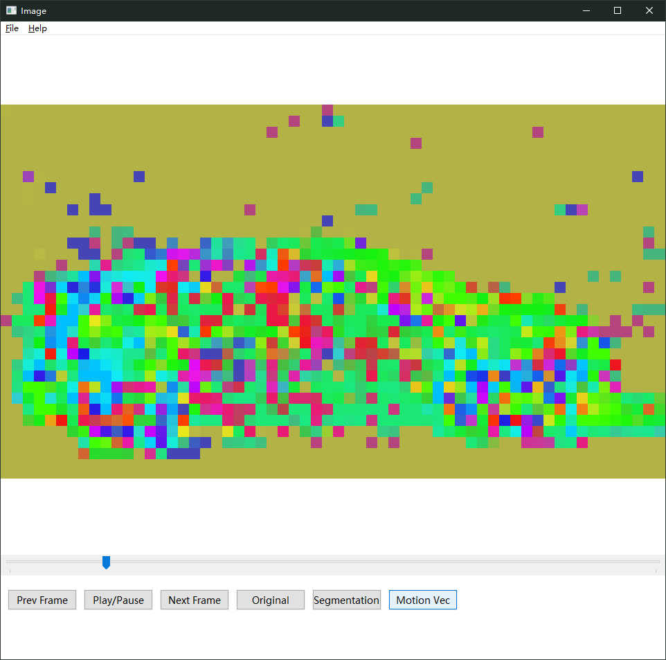
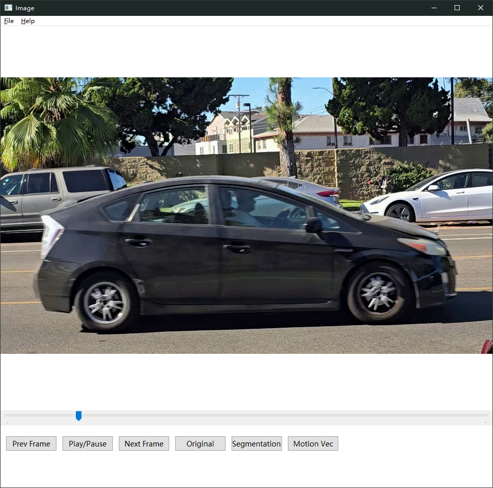
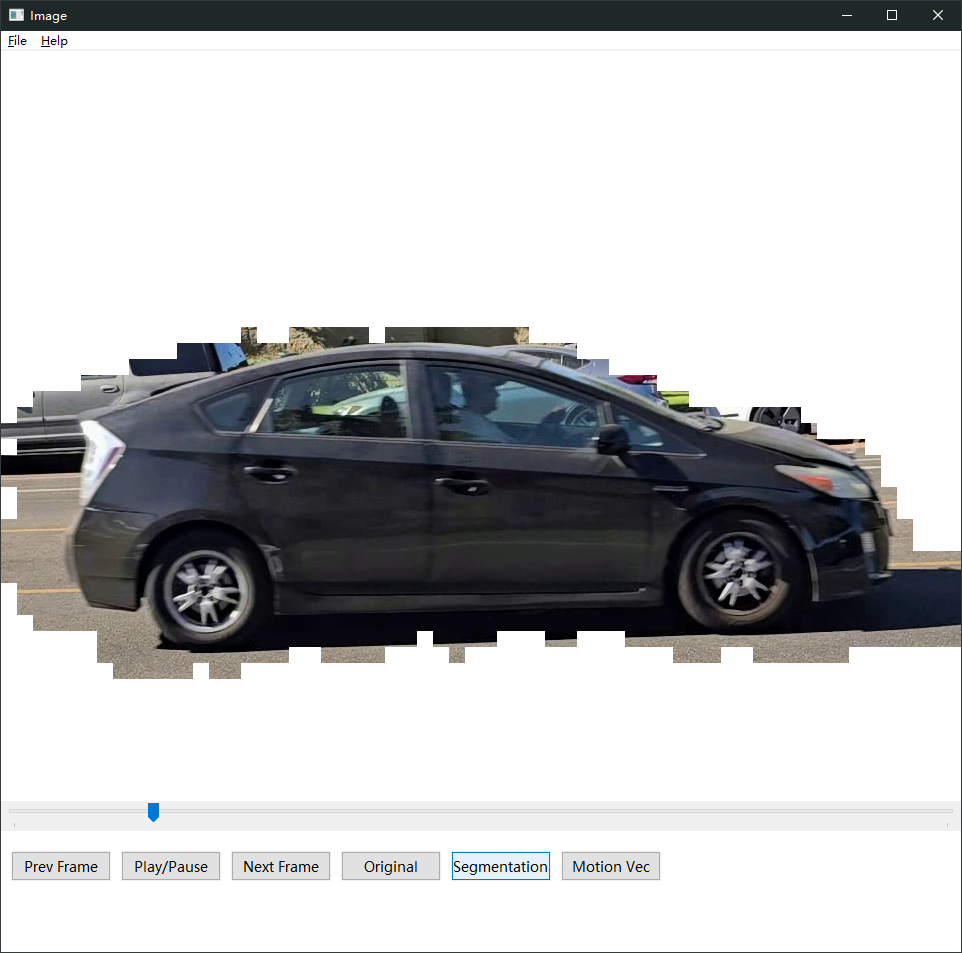
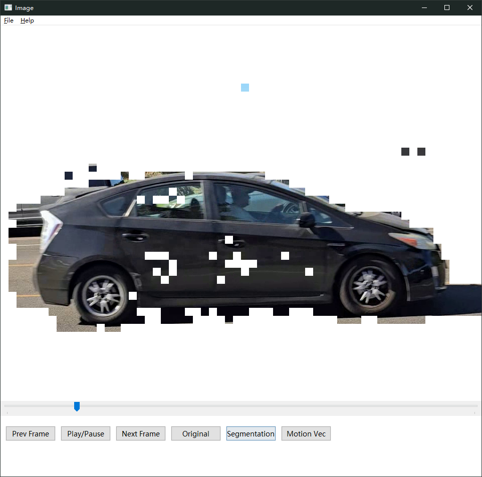
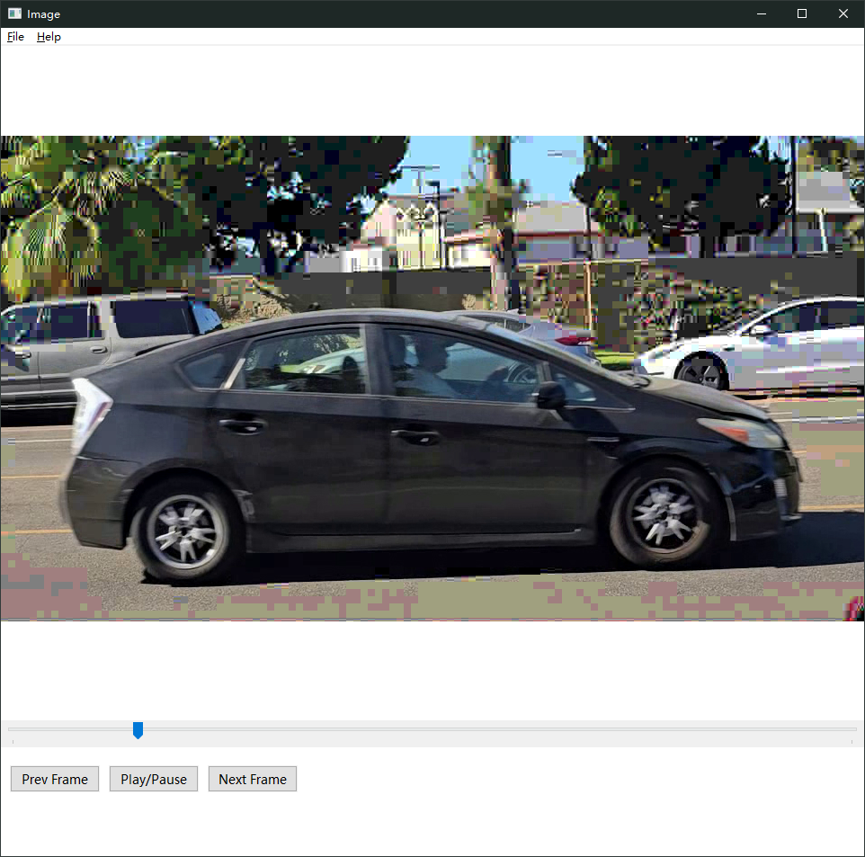

# Motion-Based Video Segmentation and Compression

A C++ video encoder/decoder pipeline for motion-based foreground/background segmentation and region-aware compression.

## Overview

This project leverages block-based motion detection to segment video frames into distinct motion layers, separating dynamic foreground content from the dominant background motion. The segmented regions are then compressed using different quantization settings, improving storage and transmission efficiency while preserving more detail in visually important regions.

The project includes:

- A custom **encoder** that reads raw RGB video, computes motion vectors, performs foreground/background segmentation, and writes compressed output to a custom `.cmp` format
- A custom **decoder** that reconstructs frames from the `.cmp` file and plays them back with synchronized audio
- A Windows-based player with **play/pause**, **frame stepping**, **seeking**, and **audio-video synchronization**
- Optional **OpenMP** parallelization for faster processing
- An experimental **GPU path** using C++ AMP

---

## Method

### 1. Motion Estimation
- For each pair of adjacent frames, the encoder divides the frame into **16×16 macroblocks**
- Motion vectors are computed using block matching within a local search window
- The dominant global motion pattern is treated as background motion

### 2. Foreground / Background Segmentation
- Macroblocks consistent with the dominant motion are marked as **background**
- Remaining macroblocks are treated as **foreground**
- Morphological cleanup is applied to reduce noise in the segmentation result

### 3. Region-Aware Compression
- Each frame is divided into **8×8 blocks**
- A **DCT-based compression** pipeline is applied to all RGB channels
- Foreground and background blocks use different quantization settings:
  - `N1`: quantization parameter for foreground region type
  - `N2`: quantization parameter for background region type

### 4. Decoding and Playback
- The decoder reads the custom `.cmp` file
- Quantized coefficients are dequantized and reconstructed with **inverse DCT**
- Frames are rendered in a Windows-based player with synchronized audio playback

---

## Results

### Demo
A GIF demo of the playback pipeline (use data/cut.rgb):

### Motion Vector Visualization
Motion vectors computed between adjacent frames:

### Original Frame
Original input frame:

### Segmentation Result
Foreground/background segmentation result:

### Unfiltered Segmentation
Raw segmentation before post-processing:

### Reconstructed Output
Decoded output after compression and reconstruction:

